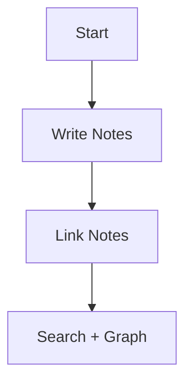

# Tessellum Feature Demo

Use this note to quickly explore what Tessellum can do.

> [!info] How to use this demo
> Read each section in order, then try the action in your own vault.

## 1) Core Markdown

Normal text, **bold**, *italic*, and ~~strikethrough~~.

### Lists

- one
- two
- three

1. first
2. second
3. third

- [x] done task
- [ ] pending task
- [ ] another pending task

> quote line one
> quote line two

### Headings

# Heading 1
## Heading 2
### Heading 3
#### Heading 4
##### Heading 5
###### Heading 6

### Divider

---

## 2) Links and Navigation

Wiki link example:

[[Untitled (1)]]

> [!tip] Tip
> Create multiple notes and connect them with wiki links to see stronger graph relationships.

## 3) Code Blocks and Inline Code

```java
public class Person {
  int age;
  String name;

  public Person(int age, String name) {
    this.age = age;
    this.name = name;
  }
}
```

Inline code example: `Person(int age, String name)`.

## 4) Callouts

> [!success] Success
> This is a success callout.

> [!note] Note
> This is a note callout.

> [!warning] Warning
> This is a warning callout.

> [!important] Important
> This is an important callout.

### Terminal Callout Style

> [!terminal] Person.java
> public class Person {
>   int age;
>   String name;
> }

## 5) Mermaid Diagrams



## 6) Tables

| Feature | Supported | Notes |
| --- | --- | --- |
| Task lists | Yes | `- [ ]` and `- [x]` |
| Callouts | Yes | Multiple callout types |
| Mermaid | Yes | Rendered from fenced blocks |
| LaTeX | Yes | Inline and block |

## 7) LaTeX

Block math:

$$
\begin{bmatrix}
\frac{1}{2} & \frac{3}{4} \\
\int_0^1 x\,dx & \sum_{n=0}^{\infty} n
\end{bmatrix}
$$

Inline math: $3 + 2 = 5$.

## 8) Slash Commands and Toolbar

> [!info] Slash commands
> Type `/` in the editor to open the insert menu for supported markdown elements.

> [!tip] Formatting toolbar
> Select text to show the toolbar and quickly apply bold, italic, strikethrough, and list formatting.

## 9) Editor Modes

Use the title bar mode selector to switch between:

- Reading
- Live Preview
- Source

Reading mode is view-focused; Live Preview and Source mode are editable.

## 10) Keyboard Shortcuts

> [!info] Common shortcuts
> - `Cmd/Ctrl + K`: Open command palette
> - `Cmd/Ctrl + P`: Quick search panel
> - `Cmd/Ctrl + T`: New note
> - `Cmd/Ctrl + J`: Toggle sidebar
> - `Cmd/Ctrl + G`: Toggle graph view
> - `Cmd/Ctrl + ,`: Open settings
> - `Cmd/Ctrl + Space`: Toggle workspace overview
> - `Cmd/Ctrl + B`: Bold selected text

## 11) Command Palette

> [!info] Command palette
> Open with `Cmd/Ctrl + K` to run actions such as creating notes/folders, opening settings, and changing views.

## 12) Media Embeds

Embed files like images or PDFs with:

`![[Path/to/item.extension]]`

Example:

`![[assets/diagram.png]]`

## 13) Search

You can search by text, tags, or both.

Examples:

- Plain text: `Normal Markdown Text`
- Single tag: `#template`
- Multiple tags: `#template #explain`
- Combined: `#template markdown`

Tessellum also keeps recent searches for quick reuse.

## 14) Graph View

Graph view helps visualize note relationships.

> [!tip] Graph filtering
> Use the side panel query/filter tools and built-in Cypher examples to narrow results.

## 15) Daily Notes and Templates

> [!tip] Daily notes
> Use the calendar action in the sidebar to create or open today's daily note from your daily-note template flow.

> [!tip] Template notes
> Create notes from templates via folder context menu or command palette.

## 16) File Tree and Vault Operations

In the left sidebar you can:

- open/switch vaults
- create notes and folders
- rename and move items
- use context menu actions
- copy/paste files into the vault

## 17) Right Sidebar: Backlinks, Tags, Outline

The right sidebar includes:

- backlinks to the active note
- tags detected from inline text and frontmatter
- outline navigation for headings

## 18) Trash

> [!important] Trash behavior
> Deleted notes are moved to `.trash` inside the vault, not immediately removed.
> You can restore items or delete them permanently from the Trash panel.
> Items will be automatically deleted after 30 days.

## 19) Settings and Customization

Settings include:

- General (language, spell check)
- Editor (font, line height, Vim mode, line numbers)
- Appearance (theme, schedule, accent, layout, terminal/code colors)
- Accessibility (contrast, UI scale, reduced motion, color filters)
- Shortcuts
- Plugins (enable/disable supported plugins)

---

## Done Exploring?

Try this next:

1. Create 3 notes and connect them with `[[wiki links]]`.
2. Add tags in frontmatter and inline (`#project/demo`).
3. Search with mixed queries (for example `#feature-demo graph`).
4. Open Graph view and verify the note connections.

